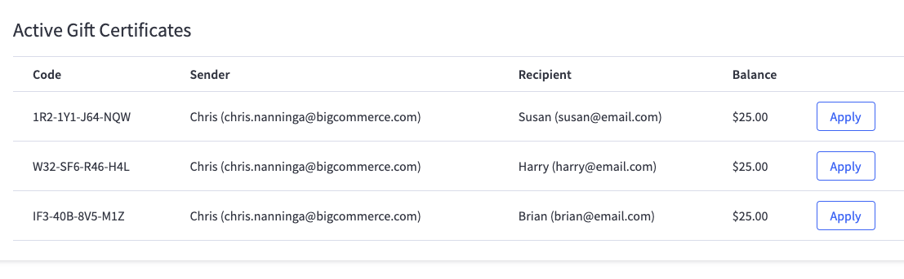
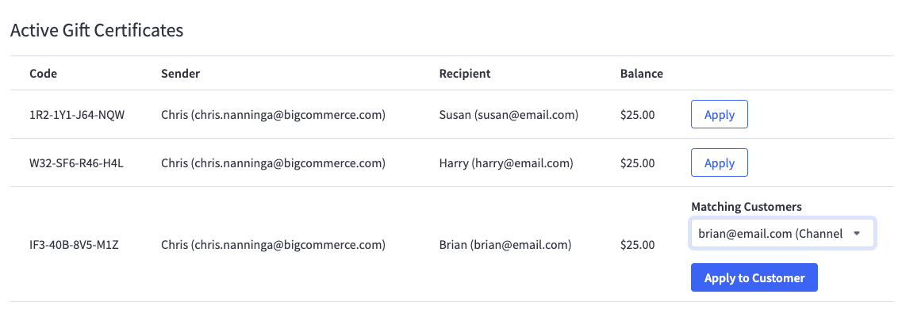
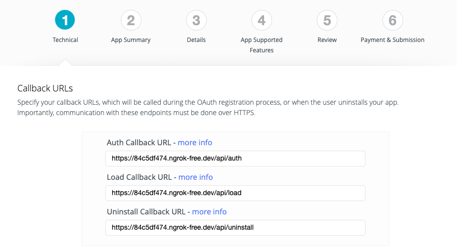
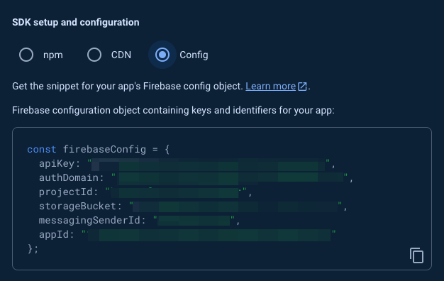

# Prerequisites

* Node.js 20 or later

# Setup

## Setup Steps

1. Enable `pnpm` if it's not already enabled:

```shell
corepack enable pnpm
```

2. Install the `starter` code state:

```shell
pnpm create next-app@latest -e https://github.com/bigcommerce-edu/lab-gift-certs-manager-app/tree/starter /path/to/working/directory
```

3. In your BigCommerce store control panel, create a new store API token at Settings > "Store-level API accounts" with the following scopes:

| Scope | Level |
| --------- | ------ |
| Customers | modify |
| Marketing | modify |

Copy the client ID and access token.

4. Copy `.env.example` and `.env.local` and enter config details:

```
STATIC_CLIENT_ID={your API account client ID}
STATIC_V3_TOKEN={your API account token}
STATIC_STORE_HASH={your store hash}
```

5. Start the dev server:

```shell
pnpm run dev
```

6. Browse to the dev server (e.g., http://localhost:3000).

7. Make sure gift certificates are enabled in your store control panel, at Marketing > Gift Certificates.

8. In your storefront, navigate to Gift Certificates and add several gift certificates to the cart, for both email addresses associated with an existing customer account and email addresses that are not, and complete the checkout process to purchase.

## Touring the Application

The Gift Certificate Manager app allows admin users to view gift certificates that still have an active balance and apply them to the store credit of a customer matching the recipient email address.



Clicking "Apply" for an active gift card will search for any customers matching the recipient's email address and present these results in a drop-down.



Selecting a customer and clicking "Apply to Customer" will reduce the gift card balance to $0 and add the previous balance to the customer's store credit total.

### Important Files

All BigCommerce API interactions use REST: V2 gift certificate endpoins or V3 customer endpoints.

* **lib/client/index.ts**: Contains the fetch method used for all REST requests. Accepts a `Session` object but simply uses the static API token in its initial state.
* **lib/auth.ts**: Helper methods for BigCommerce OAuth requests and verification; not yet implemented
* **lib/session.ts**: Helper methods for managing a JWT with the control panel session; not yet implemented
* **app/active/page.tsx**: Server component where gift certificates are initially fetched
* **components/page**: Client components for pages, currently styled with `styled-components`
* **components/active-gift-certs**: Client component and server actions related to the "actions" column of the gift certificates table, currently styled with `styled-components`
* **lib/db**: Database interactions, including pre-built Firebase integration methods for storing and retrieving store/token information

As you browse around the app, notice the logging of the "token type" and client ID in your dev server terminal output, which currently correspond with the static API token you generated.

```json
{
  "tokenType": "static",
  "storeHash": "{store hash}",
  "clientId": "{API account client ID}",
}
```

Try out clicking "Apply" for a gift card whose recipient email corresponds with an existing customer account, then choose the customer from the drop-down and "Apply to Customer." Verify that the customer's store credit balance increases by the gift card amount. (You can also manually use the `v2/gift_certificates` API endpoint to verify the gift card balance is $0.)

# Lab 1

## Step 1: Set up Remote Tunnel and Create App

1. Sign up for a free [ngrok](https://ngrok.com/) account.
2. Follow the `ngrok` [Getting Started](https://ngrok.com/docs/getting-started/) instructions.
3. Start `ngrok` to run a secure tunnel for the port of the local dev server:

```shell
ngrok http 3000
```

4. Look for the generated domain in the `ngrok` output:

```shell
Forwarding                    https://84c5df474.ngrok-free.dev -> http://localhost:3000
```

Browse to the domain (e.g., https://84c5df474.ngrok-free.dev) to verify.

5. Enter the secure URL in your `.env.local` config:

```
APP_ORIGIN={ngrok domain}
AUTH_CALLBACK=${APP_ORIGIN}/api/auth
```

6. Log into https://devtools.bigcommerce.com with the _same BigCommerce account as the store owner_.

7. Create an app and fill in the callback URLs using your `ngrok` secure URL and the following paths:

* Auth Callback URL: `/api/auth`
* Load Callback URL: `/api/load`
* Uninstall Callback URL: `/api/uninstall`



8. Set "Multiple Users" to "Store Owner" and set the following OAuth scopes:

| Scope | Level |
| ----- | ----- |
| Customers | modify |
| Marketing | modify |

9. "Update and Close", then click "View Client ID" and record the app's client ID and secret.

10. Enter the app credentials and BigCommerce OAuth login URL in `.env.local`:

```
APP_CLIENT_ID={app client ID}
APP_CLIENT_SECRET={app client secret}

BC_LOGIN_URL=https://login.bigcommerce.com
```

## Step 2: Implement Installation Auth Route

This step performs the OAuth "handshake" when the app is installed, calling the BigCommerce auth endpoint and then redirecting to the app's home page.

1. [Make code changes as shown](https://github.com/bigcommerce-edu/lab-gift-certs-manager-app/compare/lab-oauth-01...lab-oauth-02).

2. In the control panel, browse to Apps > My Draft Apps.

3. Select your new app, "Install", then "Confirm".

4. Verify the home page of the app loads in the browser.

## Step 3: Transmit Session Info in JWT

This step implements logic for encoding the session information (the store hash of the user who installed/loaded the app) and adds it to the initial redirected URL.

1. Use the following command in your terminal to generate a random JWT secret:

```shell
openssl rand -hex 32
```

2. Add the secret to `.env.local`:

```
JWT_SECRET={secret}
```

3. [Make code changes as shown](https://github.com/bigcommerce-edu/lab-gift-certs-manager-app/compare/lab-oauth-02...lab-oauth-03)

4. Uninstall and re-install the app in the control panel.

5. Verify that the page loaded in the iframe, and pages navigated in the app's header tab, contain the `session` querystring parameter with a JWT value.

## Step 4: Implement Load Route

This step implements the "load" callback URL, verifying the payload sent by BigCommerce and redirecting to the app home page (with the session JWT) whenevder the app is loaded in the control panel.

1. [Make code changes as shown](https://github.com/bigcommerce-edu/lab-gift-certs-manager-app/compare/lab-oauth-03...lab-oauth-04)

2. _Without_ uninstalling the app, navigate to a different area of the store control panel and then back to the app.

3. Verify the app home page loads again, with the `session` querystring parameter containing a JWT value.

# Lab 2

## Step 1: Connect Firebase Storage

1. Use a Google account to log into [Google Firebase](https://firebase.google.com/), and "Go to Console."

2. Create a new project.

3. Use the gear icon to open the project's settings, then in the General tab create a web app.


4. In the Firebase console, navigate to Build > Firestore Database and create a new database.

5. Choose "Start in test mode" and finish creating the database.

6. Use the gear icon to open the project's settings and select the "Config" output for your web app under "Your apps."



7. Enter the Firebase `apiKey`, `authDomain` and `projectId` in `.env.local`:

```
FIRE_API_KEY={apiKey}
FIRE_DOMAIN={authDomain}
FIRE_PROJECT_ID={projectId}
```

## Step 2: Store the OAuth Token

This step uses Firebase storage to save the token obtained in the initial OAuth call when the app is installed.

1. [Make code changes as shown](https://github.com/bigcommerce-edu/lab-gift-certs-manager-app/compare/lab-db-storage-01...lab-db-storage-02)

2. In the store control panel, _uninstall and re-install_ the app.

3. Verify that the Firestore databsae contains a `store` collection with a document matching the store hash and containing an `accessToken`.

## Step 3: Use the Stored Token

This step converts REST requests to use the OAuth token stored when the app was installed, making use of the store hash in the `session` JWT to retrieve the token.

1. [Make code changes as shown](https://github.com/bigcommerce-edu/lab-gift-certs-manager-app/compare/lab-db-storage-02...lab-db-storage-03)

2. Change `API_TOKEN_MODE` to "app" and remove the `STATIC_*` values in `.env.local`"

```
API_TOKEN_MODE=app

STATIC_CLIENT_ID=
STATIC_V3_TOKEN=
STATIC_STORE_HASH=
```

3. Browse to the app in the store control panel and navigate within it.

4. Verify that the app is still functional and that the dev server terminal output shows an "app" token type with the app client ID.

```json
{
  "tokenType": "app",
  "storeHash": "{store hash}",
  "clientId": "{app client ID}",
}
```

## Step 4: Implement Uninstall Route

This step ensures the DB store record is removed if the app is uninstalled from a store.

1. [Make code changes as shown](https://github.com/bigcommerce-edu/lab-gift-certs-manager-app/compare/lab-db-storage-03...lab-db-storage-04)

2. Uninstall the app in the store control panel.

3. Verify the `store` document is removed in the Firestore database.

4. Re-install the app.

# Lab 3

## Step 1: Implement Global BigDesign Elements

This step adds the necessary global setup for the BigDesign component library and converts the header and home page to use it.

1. Observe the existing file `app/theme-provider.tsx`. This file sets up the `GlobalStyles` component needed for BigDesign, as well as the "alerts manager" necessary for alerts.

2. [Make code changes as shown](https://github.com/bigcommerce-edu/lab-gift-certs-manager-app/compare/lab-big-design-start...lab-big-design-01)

3. Navigate to the app in the store control panel and verify that the header tabs and home page appear in standard BigCommerce UI format.

## Step 2: Implement BigDesign in the Active Gift Certs Page

This step finalizes the conversion to BigDesign by converting the Active Gift Certificates page and its interactions.

1. [Make code changes as shown](https://github.com/bigcommerce-edu/lab-gift-certs-manager-app/compare/lab-big-design-01...lab-big-design-02)

2. Navigate to the Active Gift Certificates page in the app and verify that the table and, initial buttons, and button loading animations appear in standard BigCommerce UI format.

3. Click "Apply" for a gift certificate whose recipient does _not_ correspond with an existing customer account and verify the formatting of the resulting message.

4. Click "Apply" for a gift certificate whose recipient _does_ correspond with an existing customer account and verify the formatting of the resulting drop-down and button.

5. Temporarily edit `components/active-gift-certs/actions/apply-gift-cert.ts` and add an error at the top of the `applyGiftCertificate` function:

```javascript
throw new Error('Test error');
```

6. Click "Apply to Customer" and verify that the resulting error is formatted as a standard control panel notification.

7. Remove the error in `apply-gift-cert.ts`.

8. Click "Apply to Customer" and verify the formatting of the resulting message.
